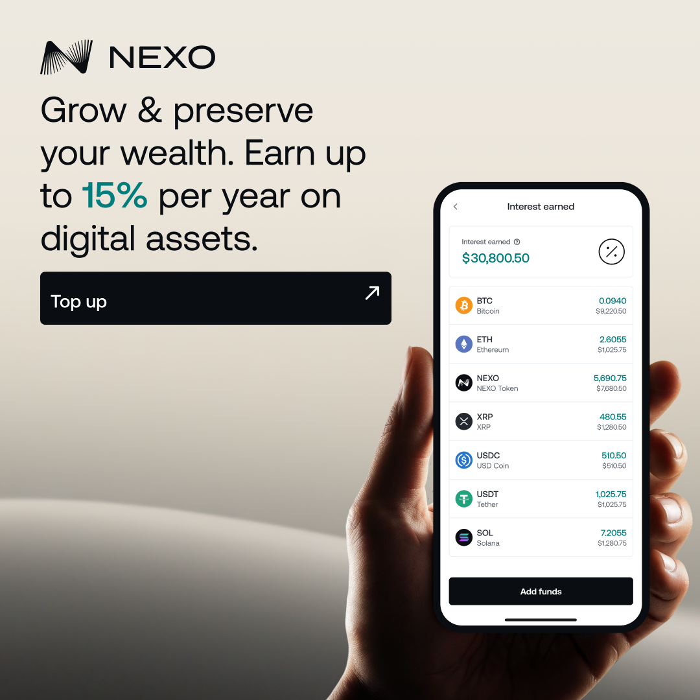
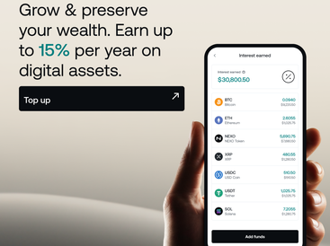

# Nexo

**Learn about Nexo.**

 

### 

[**Visit Nexo on SOFTGIT**](https://softgit.pro/p/nexo) · [Browse apps](https://softgit.pro)

---

## Overview

Learn about Nexo.

Learn about Nexo. Read Nexo reviews from real users, and view pricing and features of the Crypto Wallets software

## At a glance

- Category: Crypto Wallets
- Publisher / site: nexo.com
- Listing tag: Free trial
- Official site (from listing): https://nexo.com/
- Source listing: https://sourceforge.net/software/product/Nexo/
- Type: Business / SaaS listing (information page)

## Screenshots

  
  
  
  

## System / listing information

| Field | Value |
|---|---|
| Name | Nexo |
| Category | Crypto Wallets |
| Publisher | nexo.com |
| Platform | Any |
| License / offer | Free trial |
| Updated | October 6, 2026 |
| Listed package size | 1.1 MB |

## How to get started

1. Open the [Nexo page on SOFTGIT](https://softgit.pro/p/nexo).
2. Review the overview, screenshots, and any official website link on that page.
3. Use the page CTA to visit the vendor site or request access / trial as offered there.
4. This GitHub repo is an informational listing only — it does not host SaaS installers or account credentials.

[**Visit Nexo on SOFTGIT**](https://softgit.pro/p/nexo)

## FAQ

**What is this repository?**  
An unofficial information page for Nexo, with links to the [SOFTGIT listing](https://softgit.pro/p/nexo).

**Is software redistributed here?**  
No. SaaS products are used via the vendor’s website or apps. Do not treat any third-party zip on a listing as the product itself without verifying the source.

**Who owns this product?**  
Third-party software/service, all rights belong to the original authors and trademark owners. This repo is not affiliated with them.

---

[**Visit Nexo**](https://softgit.pro/p/nexo) · [SOFTGIT](https://softgit.pro)

Third-party software/service, all rights belong to the original authors. Unofficial listing for Nexo.

## More links

- 🌐 **[Visit Nexo on SOFTGIT](https://softgit.pro/p/nexo)** — the full listing.
- 📄 **[Nexo web page](https://borderricrush.github.io/nexo-download/)** — standalone info page.
- 🗂️ [More Crypto Wallets software](https://softgit.pro/category/crypto-wallets)
- 🏠 [SOFTGIT home](https://softgit.pro) · [All apps](https://softgit.pro/apps)
- 🔒 [Verify a download (SHA-256)](https://softgit.pro/security)

> Unofficial listing for Nexo. Third-party software; all rights belong to the original authors.
